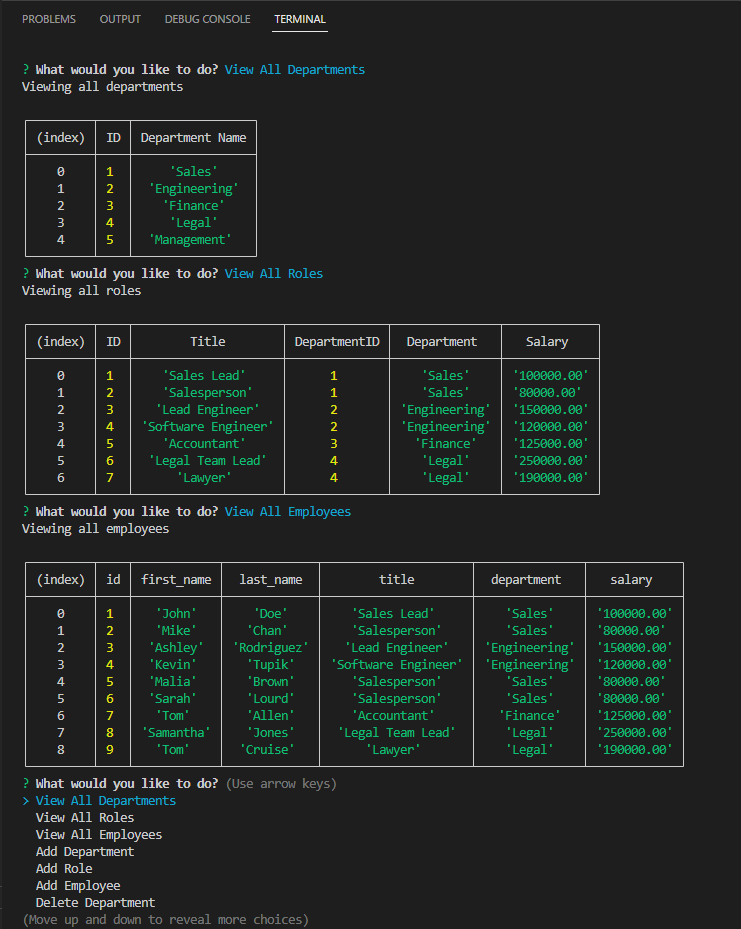

# MySQL Employee Tracker <!-- omit in toc -->

## Table of contents <!-- omit in toc -->

- [Description](#description)
- [Usage](#usage)
- [Mock Up](#mock-up)
- [Credits](#credits)
- [License](#license)
- [Links](#links)

## Description
This application allows the user to keep track of a company's departments, roles, and employees, complete with salary and personal employee information such as name and manager.

**NOTE: In order to use this application it is necessary to install the following Node.js packages: inquirer v8.2.4, asciiart-logo, dotenv & mysql2**.

## Usage
Upon completion, the user will be presented with a logo for the application and a start menu. From here, the user can select any of the available options to do the following

- View All Departments
- View All Roles
- View All Employees
- Add Department
- Add Role
- Add Employee
- Delete Department
- Delete Role
- Delete Employee
- Exit Application

## Mock Up

--- <!-- omit in toc -->

## Credits
- Code by: [Daniel Sanchez](https://github.com/Morkendi)

## License

This project utilizes an MIT License. [Read more](https://choosealicense.com/licenses/mit/)

## Links
- Link to [GitHub repo](https://github.com/Morkendi/Employee-Tracker)
- Link to [Video Demo](https://drive.google.com/file/d/1M8QILvrsiOXRWAw4k5Dw158b6J0HoyFd/view?usp=sharing)